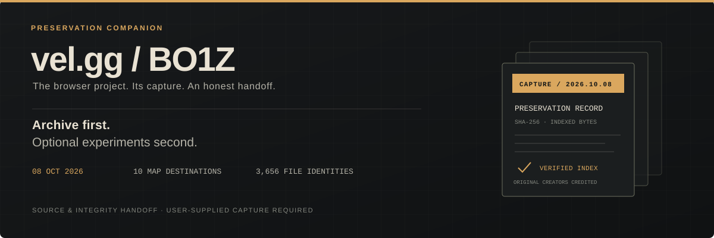

<p align="center"></p>

<p align="center"><a href="https://github.com/VinceGuyMan/vel-gg-bo1z-preservation/releases/tag/v0.1.0">Full research download</a> · <a href="https://vel.gg/bo1z/">Original project</a> · <a href="CREDITS.md">Credits</a> · <a href="docs/CAPABILITIES.md">Capabilities</a></p>

# vel.gg / BO1Z preservation

An archive of the **October 8, 2026 capture of [vel.gg/bo1z](https://vel.gg/bo1z/)**, with a separate optional preview. Original archive first; experimental improvements second.

**Original game: Treyarch / Activision. Original browser deployment: vel.gg’s creators and operators.** This repository records and extends their work; it does not claim authorship of the game or browser port. [Full credits →](CREDITS.md)

> **The full capture is included in the [research release](https://github.com/VinceGuyMan/vel-gg-bo1z-preservation/releases/tag/v0.1.0).** Download all three ZIP parts, the manifest and restoration tool; follow [these instructions](docs/DOWNLOAD.md). No website recapture is required. Git clones and GitHub’s automatic “Source code” ZIP contain tools/sources only.

**Launcher update:** [v0.1.1 automatic-port fix](https://github.com/VinceGuyMan/vel-gg-bo1z-preservation/releases/tag/v0.1.1) is a small separate download. Use it on both machines; keep the original archive. [Update steps](docs/PORTFIX.md)

## Preservation record

| Captured October 8, 2026 | Verified scope |
| --- | --- |
| 3,656 files · 6,351,964,605 bytes | Every indexed file passed SHA-256 verification. |
| Ten published maps · ten base / six Horde manifests | Listed game downloads, audio variants and cinematic streams saved. |
| 673 manifest transport entries | Declared decoded sizes and hashes passed. |
| Original offline replay | Menu and ten map pages checked; Five reached its engine ready/cinematic screen. |

This preserves delivered client resources, not the operator’s unpublished source or infrastructure. Some optional upstream caches were already absent. Ten captured maps does not mean ten completed gameplay tests. [Capture details and original replay →](docs/PRESERVATION.md)

After extraction, verify the included capture with Python 3.10+:

```sh
python3 tools/archive_inventory.py --archive "/path/to/vel-gg-bo1z-2026-10-08"
```

On Windows use `py -3`. The verifier is read-only. The [original integrity index](preservation/SHA256SUMS.capture.txt) and [portable inventory](evidence/preservation-inventory.json) are included here.

## Optional improvements

The separate preview adds **Solo / Multiplayer / Settings**, standard Xbox/PlayStation controller input, and experimental networking around the original engine.

| Demonstrated | Still unfinished |
| --- | --- |
| Two original-engine players on one Mac; shared movement, zombie damage/death, points, purchase and down state. | Dependable Mac/Windows matches; doors, revive, rounds and reconnect. |
| Physical LAN shared spawns and guest movement reaching the host. | Consistent control in both directions; intermittent native input fault unresolved. |
| Public HTTPS/WSS relay passed generated-packet tests. | Separate-network Internet gameplay, four native players and forced TURN. |
| Title/browser checks and simulated controller navigation. | Physical controller gameplay and all-map runtime validation. |

**Co-op and online packet relay are feasible. This is not a finished online co-op release.** Earlier game/relay observations do not validate the exact final menu/controller preview. [Every capability and limit →](docs/CAPABILITIES.md)

The full research download includes a separate built preview. To reconstruct it from source:

```sh
python3 build_local.py --archive "/path/to/archive" --output "../bo1z-preview-local"
```

Use a new output outside the archive and repository. Game launch requires Chromium and Python 3.10+; Windows also needs Node.js 22/24/26. [Setup, controls and relay limitations →](docs/EXPERIMENTAL.md)

## Handoff

Preservation and experimental research are handed off as of **October 9, 2026**. Co-op development is paused; there is no scheduled follow-up or multiplayer support promise. Forks, documented fixes and credit corrections are welcome. [Research evidence](docs/RESEARCH.md) · [Contribution guide](CONTRIBUTING.md)

The research download contains copyrighted original game material. Existing rights remain with their holders; this archive grants no license or official endorsement. Matching complete deployed source and redistribution permissions were not established. [Provenance and rights](PROVENANCE.md)
