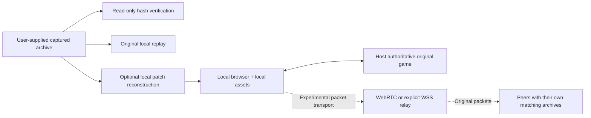

# Keep preservation and experiments separate

The archive is never patched in place. The preview serves modified shell/input paths and a separate reconstructed engine with its own cache/channel/build identity. The 13-field peer identity covers engine, patch, shell and selected map; it admits matching packages, not gameplay correctness.

The host owns game authority. Guests exchange the engine’s existing packets through a star route; assets stay on each computer. Signaling carries joins/room state. The optional public service exposes lobby/API and authenticated relay routes, not game files.

WebRTC and WSS are explicit room choices. WSS/TCP is not TURN, UDP or an automatic fallback. The proof record separates packet routing from native gameplay and one-machine tests from separate-network Internet tests.
